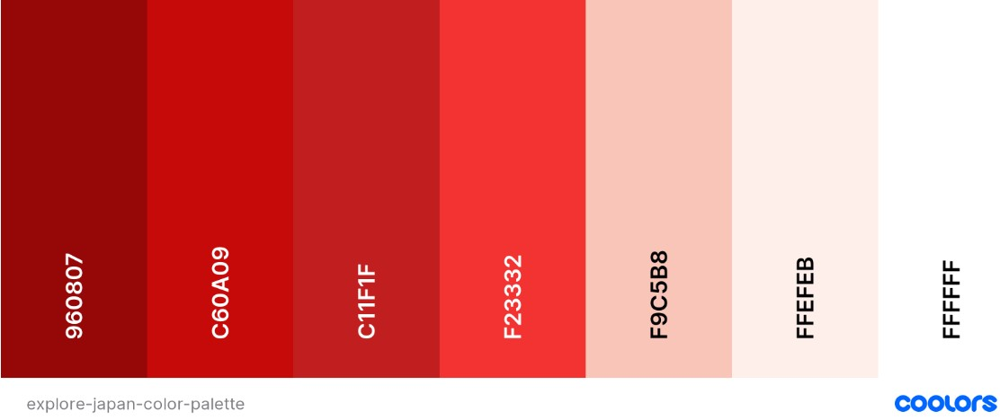

# Explore National Parks of Japan

*Developed and designed as part of Milestone Project 2: Interactive Front-end Development module.*

[Please view the live project here](https://fruitbatm.github.io/explore-national-parks-of-japan/)

<h2 align="center"></h2>

Mockup responsive image was created with [Techsini](http://techsini.com/multi-mockup/index.php).

## Table of Contents

  
Click to expand table of contents

1. [Overview](#overview)
2. [User Experience UX](#user-experience-ux)
    - [User Stories](#user-stories)
        - [Visitor Stories](#visitor-stories)
    - [Strategy](#strategy)
    - [Scope](#scope)
    - [Structure](#structure)
    - [Skeleton](#skeleton)
    - [Design](#design)
    - [Color Scheme](#color-scheme)
    - [Fonts](#fonts)
    - [Imagery](#imagery)
    - [Logo](#logo)
    - [Icons](#icons)
3. [Features](#features)
    - [Existing Features](#existing-features)
    - [Future Implementation](#future-implementation)
4. [Technologies](#technologies)
5. [Testing](#testing)
6. [Deployment](#deployment)
    - [GitHub pages](#github-pages)
    - [Forking the Repository](#forking-the-repository)
    - [Local Deployment](#local-deployment)
7. [Credits](#credits)
    - [Code](#code)
    - [Media](#media)
    - [Content](#content)
8. [Acknowledgements](#acknowledgements)
9. [Disclaimer](#disclaimer)

# Overview

Explore National Parks of Japan is a mobile-first one-page website that aims to users that love travelling, outdoors and enjoy adventures in nature.
The website is designed to be pleasing to the eye and to provide useful information about the most beautiful national parks in Japan, how to get there and to provide weather information.
The main goal of the website is to promote beautiful national parks Japan has to offer and to inspire people to travel and experience different culture.

The website was created as a **Milestone Project 2** as a part of **Diploma in Full Stack Software Development** with **Code Institute**. The project is developed using HTML, JavaScript and CSS programs.

# User Experience (UX)

## User Stories

### Visitor Stories

1. As a site visitor, I would like to gain an understanding of the website's purpose from the landing page.
2. As a site visitor, I would like to easily navigate through the site and find what I am looking for with an ease.
3. As a site visitor, I would like to find the aesthetics of the website enjoyable.
4. As a site visitor, I want to use interactive elements on the website.
5. As a site visitor, I would like to be able to easily find and navigate to the company's social media.
6. As a site visitor, I want to get in touch if I might have any queries.
7. As a site visitor, I want to use map to find exciting national parks in Japan and based on the provided information decide what places to visit.
8. As a site visitor, I want to get information how to get to the national parks.
9. As a site visitor, I want to find about the current weather and accordingly plan my visit.
10. As a site visitor, I want to find out about the current weather and accordingly plan my visit.

## Strategy

The user experience is simple and easy to use with an effective and clear navigation experience.

### Project Goals

- To enable easy access to the information needed about national parks to plan the trip.
- To show the information about the most beautiful Japan's national parks to visit.
- To provide the information on how to get there.
- To ensure the users can get live weather forecast.
- The content provided is relevant and regularly updated.

## Scope

- Fully responsive single page mobile first website.
- The use of APIs to show relevant information to the user.
- Interactive features that allow the user to engage and find needed information.
- An easy-to-use contact form that sends emails to the owner using EmailJS.

## Structure

The website will be designed to be pleasing to the eye, consistent and user friendly.
- Interaction Design
    - Consistent design will be used throughout the website to maintain a good UX.
    - The overlay navigation with effective background image will make the website look elegant and attractive.
    - The users will be able to interact with Google Map by clicking on the map markers. Additionally, when selecting a national park from a dropdown list, weather data will get displayed.

- Information Architecture (IA)
    - The project was conceptualized as a single page website, divided in four sections. This structure was used because it is simple and familiar to the site visitors and it is sufficient for all user stories.
    - Short paragraphs providing the relevant information will be used. This approach was selected to provide enough information, yet not to overwhelm.
    - The content is organized and categorized by importance from top to bottom and left to right.

## Skeleton
The wireframes were created in [Balsamiq](https://balsamiq.com/).
Please view the wireframes for desktop, tablet and mobile screens on the following link:
[Explore National Park of Japan wireframes](https://github.com/FruitbatM/explore-national-parks-of-japan/blob/master/readme-files/wireframes/MS2-wireframes.pdf).

## Design

### Color Scheme

The traditional colors of Japan will be used for the project, primarily variations of red and white.

- Venetian Red (#C60A09)
- White (#FFFFFF)
- Red Pigment (#F23332)
- Seashell (#FFEFEB)
- Melon (#F9C5B8)
- Dark Red (#960807)

<h2 align="center"></h2>

[Coolors](https://coolors.co/) was used to create a color palette.

A Venetian Red (#C60A09) color will be used for hero text background, social media icons, headings, button and for footer section. According to the article [The Traditional colors of Japan](https://www.tofugu.com/japan/color-in-japan/) red color is associated with authority, ambition and determination.

White (#FFFFFF) and Seashell (#FFEFEB) colors will be used primarily as background colors interchangeably to differentiate different website sections, respectively. Also, white will be used for navigation section.
A white color is light, neutral, and combining it with red it speaks of love and passion. Seashell color will be used because of its light note and closeness to cherry blossom color which is a symbolic flower of Japan.

Melon (#F9C5B8) and Dark Red (#960807) colors will be only used under Weather section. This combination will be used due to contrast between the foreground and background.

### Fonts

- Two fonts will be used throughout the project, **Crimson Pro** and **Work Sans**. Crimson Pro will be used with ``serif`` font as a fallback and Work Sans will be used with ``sans-serif`` font as a fallback.
**Crimson Pro** will be used for the main headings and **Work Sans** will be used for the hero text, paragraph sections and the footer.

- These fonts pair very well together and make the website appear both prestigious and contemporary. They make a good combination of tradition and modernity.

- Fonts were imported from [Google Fonts](https://fonts.google.com/).

### Imagery

- For the website I used impactful images to attract the user's attention and to try to influence user's decision to visit one of the national parks.
- I paid attention that the images match the captions and are labeled with keywords important to the website content to improve onsite SEO.
- All images are sized and compressed for the best user experience.

### Logo

- I used [Canva](https://www.canva.com/) to design the custom logo. 
- The logo was inspired by Japan, the land of the rising sun. A crimson-red circle inside which a map marker with a traditional pagoda is placed. In my opinion it well represents the theme of the website.

<h2 align="center"></h2>

### Icons

- Several icons will be used from [Font Awesome](https://fontawesome.com/) to improve the website's UX.

# Features

Explore National Parks of Japan will be built to be fully responsive mobile-first website. This will be primarily achieved by utilizing the Bootstrap's grid system.
The website will be a single page website separated in four sections: Explore, Map, Weather and Contact. Website will have a full screen overlay navigation which will allow user to easily navigate to each section. Also, back to top arrow button ('arrow 2 top') will allow to easily navigate to the top of the page.

## Existing Features

- Navigation Menu
    - A full screen overlay navigation, responsive on all devices.
    -  When hover over navigation link, the color changes.
- Responsiveness
    - By using the mobile-first approach, the website will be built to be fully responsive.
- Hero image
    - An effective hero background image will be used to gain instant user attention.
    - Hero text centrally placed in transparent text box.
- Interactive
    - Bouncing arrow located at the bottom of the hero image. When clicked, it scrolls to the next section.
    - Back to top arrow button will appear on the lower right of the page when the user starts to scroll down the page.
    - Buzz out social media icons when the user hovers over.
- Social media
    - Social media icons will be located at the website's header to grab immediate users' attention.
    - Allow users to find more information on national parks on the social media.
- Google Maps API
    - Used to show the location of ten most beautiful national parks in Japan.
    - Google Map markers place functionality to pinpoint exact national park locations.
    - When the user clicks on the marker, the custom info window with the national park's name will appear and the national park information with the corresponding image will change on the left side. The info window will close when the user clicks the same marker or when clicked anywhere on the map.
- OpenWeather API
    - Will be used to display national parks weather forecast.
    - The user will select a national park from the dropdown menu list. Upon the selection, the weather information will get displayed with the current and today's weather data.
- Tooltips
    - Tooltips were not initially planned but were added later as a helper tool to indicated the users about the feature functionality under the map and weather sections. Tooltip text appears when the user hovers over the 'i' icon located next to the Map and Weather headings.
- Contact form
    - Contact form is connected using EmailJS which allows users to send emails directly without using the server.
    - SweetAlert2 will be used to add an interactive custom modal popup window when the user submits a contact form.
    - success or error message will display depending on if the user correctly or incorrectly uses the forms on the website.

## Future Implementation

- Newsletter subscription
- Add a blog section
- Create 404 error page
- Expand content with places to stay and things to do

# Technologies

## Languages

- [HTML5](https://en.wikipedia.org/wiki/HTML5) was used to complete the structure of the website.
- [CSS3](https://en.wikipedia.org/wiki/CSS) was used to style the website.
- [JavaScript](https://en.wikipedia.org/wiki/JavaScript) was used to make webpage interactive.

## Frameworks, Libraries and Programs

- [Bootstrap v.4.6.](https://getbootstrap.com/docs/4.6/getting-started/introduction/) was used to create the contact form and footer section as well to make the website responsive.
- [jQuery](https://jquery.com/) was usded for tooltip functionality.
- [Balsamiq](https://balsamiq.com/) was used to create the wireframes for the website.
- [Font Awesome](https://fontawesome.com/) icons were used in the header section and throughout the website for better user experience.
- [Google Fonts](https://fonts.google.com/) was used to import the fonts to the website.
- [Favicon](https://favicon.io/favicon-converter/) was used to create the favicon for the website.
- [CSS Tricks](https://css-tricks.com/) was used as a general source.
- [W3School](https://www.w3schools.com/) was used as a general source.
- [Stackoverflow](https://stackoverflow.com/) was used as a general source.
- [GitHub](https://github.com/) was used for repository hosting and for storing the source code.
- [Gitpod](https://gitpod.io/) was used as the development environment for writing the code.
- [Git](https://git-scm.com/) was used as version control system to add, commit and push code to GitHub.
- [Adobe Photoshop Express](https://photoshop.adobe.com/) was used for resizing and cropping the images used on the website.
- [TinyJPG](https://tinyjpg.com/) was used for compressing images while preserving transparency.
- [Techsini](http://techsini.com/multi-mockup/index.php) was used to create the responsive mockup image.
- [Coolors](https://coolors.co/) was used for colour palette used on the website.
- [CSS Autoprefixer](https://autoprefixer.github.io/) was used for adding CSS vendor prefixes.
- [Google Chrome Developer Tools](https://developers.google.com/web/tools/chrome-devtools) was used to test and debug the code.
- [Google Maps API](https://developers.google.com/maps/documentation/javascript/overview) was used to display Google Map within the website.
- [OpenWeatherMap API](https://openweathermap.org/api) was used to display current weather data for selected locations. 
- [EmailJS](https://www.emailjs.com/) was used to create an email template and enable users to send emails directly without using the server.
- [SweetAlert2](https://sweetalert2.github.io/) was used to add an interactive custom modal popup box when the user submits a contact form.

## Validation
- [W3C Markup Validation Service](https://validator.w3.org/) was used for Markup validation.
- [W3C CSS Validation Service](https://jigsaw.w3.org/css-validator/) was used for CSS code validation.
- [JSHint](https://jshint.com/) was used for JavaScript code validation.

# Testing
Testing process was written in a separate file. 
Please click [here](testing.md) for the testing process.

# Deployment

## GitHub pages

The project deployment to GitHub Pages is explained in the below steps:

1. Login into GitHub, locate and select [Explore National Parks of Japan](https://fruitbatm.github.io/explore-national-parks-of-japan/) from the list of Repositories.
    
    

2. At the top of the Repository page, under the sub-headings, select "Settings" button.
    
    

3. Scroll down the page until you reach "GitHub Pages" section.
4. Under the "Source" sub-section, select "master" branch.
5. Click "Save" button.
6. The page will refresh. To locate the link to the published site, scroll down again to the "GitHub Pages" section. Your link will be highlighted in the green box per screenshot below.

    

## Forking the Repository

To fork the repository please follow the below steps:

1. Go to the main page of Explore National Parks of Japan [repository](https://github.com/FruitbatM/explore-national-parks-of-japan).
2. At the top right corner of the page click on the "Fork" button.

 

3. You have forked the repository.

## Local Deployment

To create a local copy of the repository please follow the below steps:

1. Login into GitHub with your account.
2. Go to the [project repository](https://github.com/FruitbatM/explore-national-parks-of-japan).
3. Click on the "Code" button (located next to the green "Gitpod" button).
4. From the dropdown menu copy the HTTPS URL.
5. In your local IDE open the terminal.
6. Change your working directory to the location where you want the cloned project saved.
7. Type "git clone" and paste copied URL.

    `git clone //github.com/USERNAME/REPOSITORY`

8. Press enter and your repo will be created.

# Credits

## Code

 - [W3School](https://www.w3schools.com/) was used:
    - to create 'Back to Top Arrow' using JavaScript - credit was given in scroll.js file
    - for a full screen overlay navigation
- [Hover.css](https://ianlunn.github.io/Hover/) was used for social media icons animation
- Send email function was adapted from Code Institute walkthrough project
- [sweetalert2](https://sweetalert2.github.io/) was used for a custom pop-up alert
- [CSS Tricks](https://css-tricks.com/snippets/css/media-queries-for-standard-devices/#top-of-site) was used for media queries for iPad Pro 12.9"
- [Coderwall](https://coderwall.com/) was used for media queries for iPhone 5
- Tooltip functionality was sourced from [Bootstrap](https://getbootstrap.com/docs/5.0/components/tooltips/)
- A solution for changing tooltips arrow color was found on the following [Stack Overflow](https://stackoverflow.com/questions/44955201/bootstrap-4-change-tooltip-arrow-color) post.
- Info window feature for Google Maps for adopted from the following [Stack Overflow](https://stackoverflow.com/questions/2946165/google-map-api-v3-simply-close-an-infowindow) post

## Media

### Images

- The custom logo was designed using [Canva](https://www.canva.com/)
- Hero background image was sourced from Pexels, credit: photo by Tomáš Malík on [Pexels](https://www.pexels.com/photo/red-and-gray-pagoda-temple-3408354/)
- shikotsu-toya-np-jpg was sourced from Pexels
- mt-nantai-nikko-np.jpg was sourced from Unsplash
- fuji-hakone-izu.jpg was sourced from Stocksy, credit: photo by Gavin Hellier on [Stocksy](https://www.stocksy.com/es/38239/japan-central-honshu-chubu-fuji-hakone-izu-national-park-hakone-mount-fuji-3776m-snow-capped-and-viewed-across-lake-ashino-ko-with-the-red--torii-gates-of-hakone-jinja-rising-from-the-lake)
- akan-mashu-np.jpg was sourced from Stocksy, credit: photo by Song Heming on [Stocksy](https://www.stocksy.com/1873868/lake-mashu-in-winter)
- aso-kuju-np.jpg was sourced from Unsplash, credit: photo by Tom Vining on [Unsplash](https://unsplash.com/photos/YZ1kx79vVZI)
- iriomote-ishigaki-np.jpg was sourced from Unsplash, credit: photo by Hiroko Yoshii on [Unsplash](https://unsplash.com/s/photos/iriomote-ishigaki?orientation=landscape)
- nikko-np.jpg was sourced from Unsplash, credit: photo by DustyRoze on [Unsplash](https://unsplash.com/photos/IOUJ7VM4eaw)
- sakai-np.jpg was sourced from Stocksy, credit: photo by Song Heming on [Stocksy](https://www.stocksy.com/1122328/aerial-view-of-kujuku-islands)
- following images were sourced from [National Parks of Japan](https://www.facebook.com/NationalParksOfJapan) Facebook page with the author permission:
    - shikotsu-toya-np.jpg
    - shiretoko-np.jpg
    - towada-hachimantai-np.jpg
    - yakushima_np.jpg
    - yoshino-kumano-np.jpg

### Icons

- All icons were sourced from [Font Awesome](https://fontawesome.com/)

## Content

Below websites were used for a general layout inspiration:
- https://visithumboldt.com/
- https://www.lonelyplanet.com/japan/attractions

The text was adapted from:

- [Japan National Tourism Organization](https://www.japan.travel/national-parks/)
- [10 Most Beautiful National Parks in Japan](https://www.touropia.com/national-parks-in-japan/)

# Acknowledgements

- My mentor, Mr. Spencer Barriball, for the helpful feedback and guidance.
- [Code Institute](https://codeinstitute.net/) for all course materials and ongoing support.
- Fellow Code Institute students for their feedback and suggestions.
- My family and friends for testing and useful feedback. 

# Disclaimer

The information provided on this website is for educational purposes only.