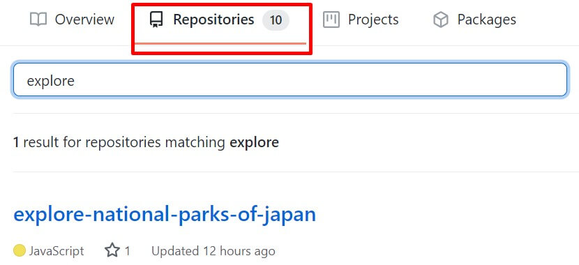
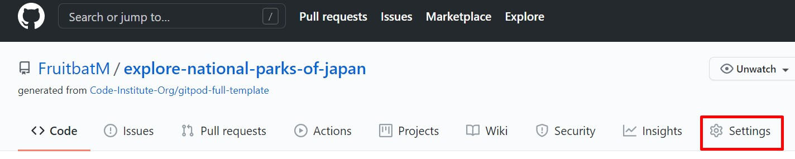
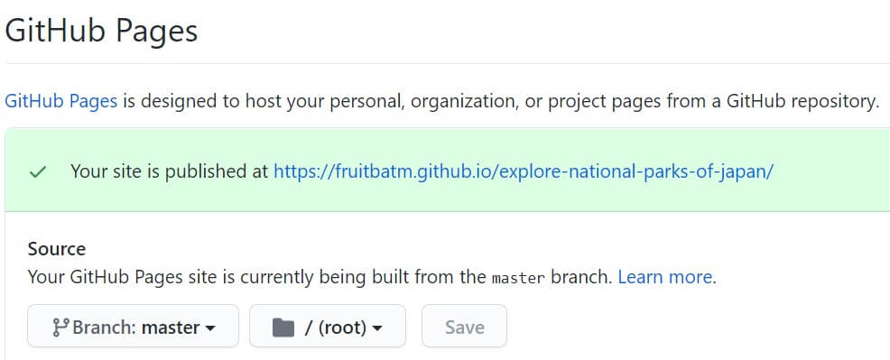
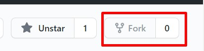

# Explore national parks of Japan                                   

*Developed and designed as part of Milestone Project 2: Interactive Front-end Development module.*

[Please view the live project here](https://fruitbatm.github.io/explore-national-parks-of-japan/)

<h2 align="center"></h2>

Mockup responsive image was created with [Techsini](http://techsini.com/multi-mockup/index.php).

## Table of Contents

  
Click to expand table of contents

> 1. [Overview](#overview)
> 2. [User Experience UX](#user-experience-ux)
>    - [User Stories](#user-stories)
>       - [Visitor Stories](#visitor-stories)
>       - [Business Stories](#business-stories)
>    - [Structure](#structure)
>    - [Skeleton](#skeleton)
>    - [Design](#design)
>       - [Colour Scheme](#colour-scheme)
>       - [Fonts](#fonts)
>       - [Imagery](#imagery)
>       - [Icons](#icons)
> 3. [Features](#features)
>       - [Existing Features](#existing-features)
>       - [Future Implementation](#future-implementation)
> 4. [Technologies](#technologies)
> 5. [Testing](#testing)
> 6. [Deployment](#deployment)
>    - [GitHub pages](#github-pages)
     - [Forking the Repository](#forking-repository)
     - [Local Deployment](#local-deployment)
> 7. [Credits](#credits)
>    - [Code](#code)
>    - [Media](#media)
>    - [Content](#content)
> 8. [Acknowledgements](#acknowledgements)
> 9. [Disclaimer](#disclaimer)

# Overview
Explore National Parks of Japan is a mobile-first one-page website (web application) that aims to users that love travelling and enjoy adventures in nature.
The website is designed to be pleasing to the eye and to provide useful information about the national parks, how to get there and give weather forecast information. 
The main goal of the website is to promote beautiful national parks Japan has to offer and to inspire people to travel and experience different culture.

The website was created as a **Milestone Project 2** as a part of **Diploma in Full Stack Software Development** with **Code Institute**. The project is developed using HTML, JavaScript and CSS programs.

# User Experience (UX)
## User Stories
### Visitor Stories
1. As a site visitior, I would like to gain an understanding of the website's purpose from the landing page.
2. As a site visitor, I would like to easily navigate through the site and find what I'm looking for with an ease.
3. As a site visitor, I would like to find the aesthetics of the website enjoyable.
4. As a site visitor,I want to use interactive elements on the website.
5. As a site visitor, I would like to be able to easily find and navigate to the company's social media.
6. As a site visitor, I want to get in touch if I might have any queries.
7. As a site visitor, I want to use map to find exciting national parks in Japan and based on the provided information make a decision what places to visit.
8. As a site visitor, I want to use map to find accomondation near the national parks.???
9. As a site visitor, I want to find about the weather forecast and accordingly plan my visit.
10. 

## Strategy
### Project Goals
- To enable easy access to the information needed about national parks to plan the trip.
- To show the most beautiful national parks to visit.
- To provide the information on how to get there.
- To ensure the users can get live weather forecast.

## Structure
The website is designed to be pleasing to the eye, consistent and user friendly.
- Interaction Design
    - Consistent design will be used throughout the website to maintain a good UX.
    - The overlay navigation with effective background image will make the website look elegant and attractive.
    - Animation effect
    - Consistent color scheme and effective images will be used to let users focus ...

- Information Architecture (IA)
    - The project was conceptualized as a one-page website, consistion of three sections. This structure was used because it is simple and familiar to the site visitors and it is sufficient for all user stories. 
    - consists of three main sections, the visitor will have a brief review of the entire webpage. In this way the user will never have to make more than three clicks to access the information she/he is looking for.
    - The content is organized and categorized by importance from top to bottom and left to right (navigation).

## Skeleton
The wireframes were created in [Balsamiq](https://balsamiq.com/).
Please view the wireframes for desktop, tablet and mobile screens on the following link:

## Design
### Colour Scheme

The traditional colours of Japan will be used for the project, primaliy variations of red and white.

- Venetian Red (#C60A09)
- Red Pigment (#F23332)
- White (#FAFAFA)
- Seashell (#FFEFEB)

According to the article [The Traditional colors of Japan](https://www.tofugu.com/japan/color-in-japan/) red colour is associated with authority and wealth.
red is considered the warmest and most contradictory of the colors.

White is godly and pure

flag of Japan is a rectangular white banner bearing a crimson-red circle at its center
land of the rising sun.

White represents purity or innocence

the shades of dark brown were emphasized throughout the website. 

- A  was used for navigation and footer sections. 
For the background I used .... colour which I alternated with the white colour to create defined sections when scrolling through the website. Furthermore, the light background works well with the dark brown text due to its contrast.

- For the buttons I used 
- [Coolors](https://coolors.co/) was used to create a colour palette.

### Fonts
- Two fonts will be used throughout the project, **Crimson Pro** and **Work Sans**. Crimson Pro will be used with ``serif`` font as a fallback and Work Sans will be used with ``sans-serif`` font as a fallback.
**Crimson Pro** will be used for the hero text and main headings and **Work Sans** will be used for the paragraph sections and the footer.

- These fonts pair very well together and make the website appear both prestigious and contemporary. They make a good combination of tradition and modernity.

- Fonts were imported from [Google Fonts](https://fonts.google.com/).

### Imagery

- For the website I used impactful images to attract the user's attention and to try to influence users decision to visit one of the national parks.
- I paid attention that the images match the captions and are labeled with keywords important to the website content to improve onsite SEO.
- All images are sized and compressed for the best user experience.

### Logo
- I used [Canva](https://www.canva.com/) to design the custom logo. 
- Add logo image here - 

### Icons
- I used several icons to improve the website's UX from [Font Awesome](https://fontawesome.com/).

# Features
Explore National Parks of Japan will be built to be fully responsive mobile-first website. This will be primarily achieved by utilizing the Bootstrap's grid system.
The website will be a single page website separated in four sections: 'explore', 'map', 'weather' and 'contact'. Website will have a full screen overlay navigation which will allow user to easily navigate to each section.
Also, back to top arrow button ('arrow 2 top') will allow to easily navigate to the top of the page.

## Existing Features
- Overlay navigation

- Responsiveness

- 

to better improve the UX so that when the user clicks on a button the page moves to the relevant information in order to reduce the users scroll time.

- Hero image

- Interactive

- Social media

- Google Maps API

- Google maps markers

- OpenWeather API

- Contact form
    - Contact form is connected using EmailJS which allows users to send emails directly without using the server.
    - SweetAlert2 was used to add an interactive custom modal popup window when a user submits a contact form.

## Future Implementation
- Newsletter subscrption
- Add a blog section
- Creating 404 error page
- Expand content with places to stay and things to do

# Technologies
## Languages
- [HTML5](https://en.wikipedia.org/wiki/HTML5) was used to _complete the structure of the website_.
- [CSS3](https://en.wikipedia.org/wiki/CSS) was used to style the website.
- [JavaScript](https://en.wikipedia.org/wiki/JavaScript) was used to make webpage interactive.

## Frameworks, Libraries and Programs
- [Bootstrap v.5.0.](https://getbootstrap.com/docs/5.0/getting-started/introduction/) was used to create the contact form and footer section as well to make the website responsive.
- [Balsamiq](https://balsamiq.com/) was used to create the wireframes for the website.
- [Font Awesome](https://fontawesome.com/) icons were used in the header section and throughout the website for better user experience.
- [Google Fonts](https://fonts.google.com/) was used to import the fonts to the website.
- [Favicon](https://favicon.io/favicon-converter/) was used to create the favicon for the website.
- [CSS Tricks](https://css-tricks.com/) was used as a general source.
- [W3School](https://www.w3schools.com/) was used as a general source.
- [Stackoverflow](https://stackoverflow.com/) was used as a general source.
- [GitHub](https://github.com/) was used for repository hosting and for storing the source code.
- [Gitpod](https://gitpod.io/) was used as the development environment for writing the code.
- [Git](https://git-scm.com/) was used as version control system to add, commit and push code to GitHub.
- [Adobe Photoshop Express](https://photoshop.adobe.com/) was used for resizing and cropping the images used on the website.
- [TinyJPG](https://tinyjpg.com/) was used for compressing images while preserving transparency.
- [Techsini](http://techsini.com/multi-mockup/index.php) was used to create the responsive mockup image.
- [Coolors](https://coolors.co/) was used for colour palette used on the website.
- [CSS Autoprefixe](https://autoprefixer.github.io/) was used for adding CSS vendor prefixes.
- [Google Chrome Developer Tools](https://developers.google.com/web/tools/chrome-devtools) was used to test and debug the code.
- [Google Maps API](https://developers.google.com/maps/documentation/javascript/overview) 
- [OpenWeather API](https://openweathermap.org/api)
- [EmailJS](https://www.emailjs.com/) was used to create an email template and enable users to send emails directly without using the server.
- [SweetAlert2](https://sweetalert2.github.io/) was used to add an interactive custom modal popup box when the user submits a contact form.

## Validation
- [W3C Markup Validation Service](https://validator.w3.org/) was used for Markup validation.
- [W3C CSS Validation Service](https://jigsaw.w3.org/css-validator/) was used for CSS code validation.
- [JSHint](https://jshint.com/) was used for JavaScript code validation.

# Testing
Testing process was written in a separate file. 
[Please click here for the full testing process](testing.md).

# Deployment
## GitHub pages
The project deployment to GitHub Pages is explained in the below steps:
1. Login into GitHub, locate and select [Explore National Parks of Japan](https://fruitbatm.github.io/explore-national-parks-of-japan/) from the list of Repositories.
    
    
2. At the top of the Repository page, under the sub-headings, select "Settings" button.
    
    
3. Scroll down the page until you reach "GitHub Pages" section.
4. Under the "Source" sub-section, select "master" branch.
5. Click "Save" button.
6. The page will refresh. To locate the link to the published site, scroll down again to the "GitHub Pages" section. Your link will be highlighted in the green box per screenshot below.

    

## Forking the Repository
To fork the repository please follow the below steps:
1. Go to the main page of Expore National Parks of Japan [repository](https://github.com/FruitbatM/explore-national-parks-of-japan).
2. At the top right corner of the page click on the "Fork" button.

 

3. You have forked the repository.

## Local Deployment
To create a local copy of the repository please follow the below steps:
1. Login into GitHub.
1. Go to the repository page.
2. Click on the "Code" button (located next to the green "Gitpod" button).
3. On a dropdown menu copy the HTTPS URL.
4. Open the terminal in an environment you would like to use to clone the site.
5. Type "git clone" and paste copied URL and run the command.

# Credits
## Code

## Media
### Images

### Icons
- Social media icons were sourced from [Font Awesome](https://fontawesome.com/)

## Content
Below websites were used for a general layout inspiration:

- The text was adapted from: 
[Japan National Tourism Organization](https://www.japan.travel/national-parks/)

# Acknowledgements
- My mentor, Mr. Spencer Barriball, for the helpful feedback and guidance.
- [Code Institute](https://codeinstitute.net/) for all course materials and ongoing support.
- Fellow Code Institute students for their feedback and suggestions.
- My family and friends for testing and useful feedback. 

# Disclaimer
The information provided on this website is for educational purposes only.