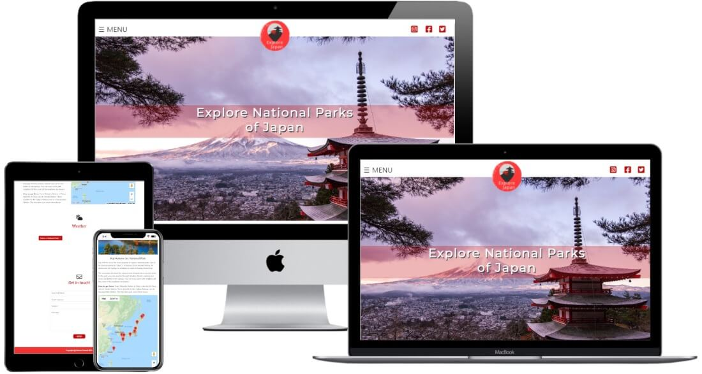

# Explore national parks of Japan                                   

*Developed and designed as part of Milestone Project 2: Interactive Front-end Development module.*

[Please view the live project here](https://fruitbatm.github.io/explore-national-parks-of-japan/)

<h2 align="center"></h2>

Mockup responsive image was created with [Techsini](http://techsini.com/multi-mockup/index.php).

## Table of Contents

  
Click to expand table of contents

> 1. [Overview](#overview)
> 2. [User Experience UX](#user-experience-ux)
>    - [User Stories](#user-stories)
>       - [Visitor Stories](#visitor-stories)
>       - [Business Stories](#business-stories)
>    - [Structure](#structure)
>    - [Skeleton](#skeleton)
>    - [Design](#design)
>       - [Colour Scheme](#colour-scheme)
>       - [Fonts](#fonts)
>       - [Imagery](#imagery)
>       - [Icons](#icons)
> 3. [Features](#features)
>       - [Existing Features](#existing-features)
>       - [Future Implementation](#future-implementation)
> 4. [Technologies](#technologies)
> 5. [Testing](#testing)
> 6. [Deployment](#deployment)
>    - [GitHub pages](#github-pages)
> 7. [Credits](#credits)
>    - [Code](#code)
>    - [Media](#media)
>    - [Content](#content)
> 8. [Acknowledgements](#acknowledgements)
> 9. [Disclaimer](#disclaimer)

# Overview
Explore National Parks of Japan is a mobile-first one-page website (web application) that aims to users that love travelling and enjoy adventures in nature.
The website is designed to be pleasing to the eye and to provide useful information about the national parks, how to get there and give weather forecast information. 
The main goal of the website is to promote beautiful national parks Japan has to offer and to inspire people to travel and experience different culture.

The website was created as a **Milestone Project 2** as a part of **Diploma in Full Stack Software Development** with **Code Institute**. The project is developed using HTML, JavaScript and CSS programs.

# User Experience (UX)
## User Stories
### Visitor Stories
1. As a site visitior, I would like to gain an understanding of the website's purpose from the landing page.
2. As a site visitor, I would like to easily navigate through the site and find what I'm looking for with an ease.
3. As a site visitor, I would like to find the aesthetics of the website enjoyable.
4. As a site visitor,I want to use interactive elements on the website.
5. As a site visitor, I would like to be able to easily find and navigate to the company's social media.
6. As a site visitor, I want to get in touch if I might have any queries.
7. As a site visitor, I want to use map to find exciting national parks in Japan and based on the provided information make a decision what places to visit.
8. As a site visitor, I want to use map to find accomondation near the national parks.???
9. As a site visitor, I want to find about the weather forecast and accordingly plan my visit.
10. 

## Strategy
### Project Goals
- To enable easy access to the information needed about national parks to plan the trip.
- To show the most beautiful national parks to visit.
- To provide the information on how to get there.
- To ensure the users can get live weather forecast.

## Structure
The website is designed to be pleasing to the eye, consistent and user friendly.
- Interaction Design
    - Consistent design will be used throughout the website to maintain a good UX.
    - The overlay navigation with effective background image will make the website look elegant and attractive.
    - Animation effect
    - Consistent color scheme and effective images will be used to let users focus ...

- Information Architecture (IA)
    - The project was conceptualized as a one-page website, consistion of three sections. This structure was used because it is simple and familiar to the site visitors and it is sufficient for all user stories. 
    - consists of three main sections, the visitor will have a brief review of the entire webpage. In this way the user will never have to make more than three clicks to access the information she/he is looking for.
    - The content is organized and categorized by importance from top to bottom and left to right (navigation).

## Skeleton
The wireframes were created in [Balsamiq](https://balsamiq.com/).
Please view the wireframes for desktop, tablet and mobile screens on the following link:

## Design
### Colour Scheme

The traditional colours of Japan will be used for the project, primaliy variations of red and white.

- Venetian Red (#C60A09)
- Red Pigment (#F23332)
- White (#FAFAFA)
- Seashell (#FFEFEB)

According to the article [The Traditional colors of Japan](https://www.tofugu.com/japan/color-in-japan/) red colour is associated with authority and wealth.
red is considered the warmest and most contradictory of the colors.

White is godly and pure

flag of Japan is a rectangular white banner bearing a crimson-red circle at its center
land of the rising sun.

White represents purity or innocence

the shades of dark brown were emphasized throughout the website. 

- A  was used for navigation and footer sections. 
For the background I used .... colour which I alternated with the white colour to create defined sections when scrolling through the website. Furthermore, the light background works well with the dark brown text due to its contrast.

- For the buttons I used 

### Fonts

- Fonts were imported from [Google Fonts](https://fonts.google.com/).

### Imagery

- For the website I used impactful images to attract the user's attention and to try to influence users decision to visit one of the national parks.
- I paid attention that the images match the captions and are labeled with keywords important to the website content to improve onsite SEO.
- All images are sized and compressed for the best user experience.

### Logo

### Icons
- I used several icons to improve the website's UX from [Font Awesome](https://fontawesome.com/)

# Features
Explore National Parks of Japan is built to be fully responsive mobile-first website.

## Existing Features

## Future Implementation

# Technologies
## Languages
- [HTML5](https://en.wikipedia.org/wiki/HTML5) was used to _complete the structure of the website_.
- [CSS3](https://en.wikipedia.org/wiki/CSS) was used to style the website.
- [JavaScript](https://en.wikipedia.org/wiki/JavaScript) was used to make webpage interactive.

## Frameworks, Libraries and Tools
- [Bootstrap v.5.0.](https://getbootstrap.com/docs/5.0/getting-started/introduction/) was used to create the contact form and footer section as well to make the website responsive.

## Validation
- [W3C Markup Validation Service](https://validator.w3.org/) was used for Markup validation.
- [W3C CSS Validation Service](https://jigsaw.w3.org/css-validator/) was used for CSS code validation.
- [JavaScript validator]() was used for JavaScript code validation.

# Testing
Testing process was written in a separate file. 
[Please click here for the full testing process](testing.md).

# Deployment
## GitHub pages

# Credits
## Code

## Media
### Images

### Icons
- Social media icons were sourced from [Font Awesome](https://fontawesome.com/)

## Content
Below websites were used for a general layout inspiration:

- The text was adapted from: 
[Japan National Tourism Organization](https://www.japan.travel/national-parks/)

# Acknowledgements
- My mentor, Mr. Spencer Barriball, for the helpful feedback and guidance.
- [Code Institute](https://codeinstitute.net/) for all course materials and ongoing support.
- Fellow Code Institute students for their feedback and suggestions.
- My family and friends for testing and useful feedback. 

# Disclaimer
The information provided on this website is for educational purposes only.