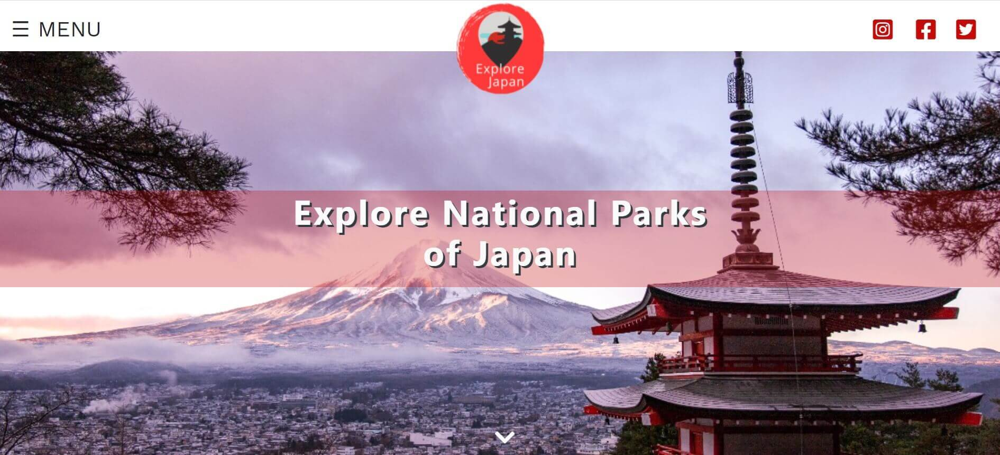
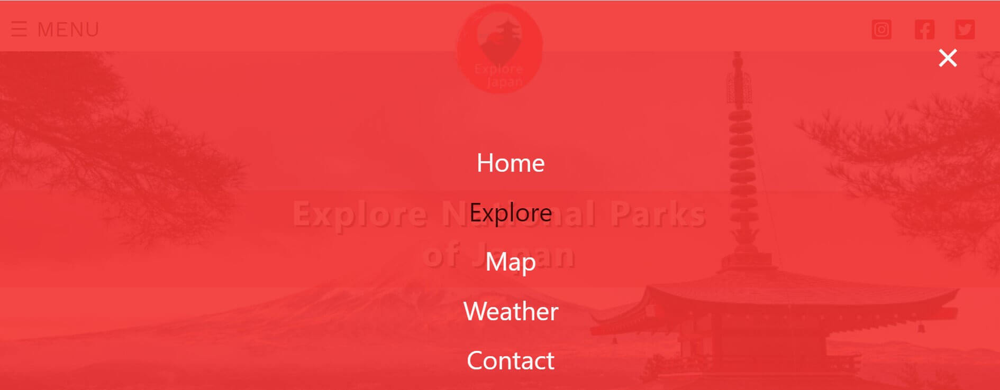

# Testing
## Table of Contents

  
Click to expand table of contents

1. [User Stories Testing](#user-stories)
2. [Code Validation](#code-validation)
3. [Functionality Testing](#functionality-testing)
4. [Encountered Issues](#encountered-issues)
5. [Performance Testing](#performance-testing)

# User Stories Testing
## Visitor Stories
**As a site visitior, I would like to gain an understanding of the website's purpose from the landing page.**
   
   - A hero image, placed towards the top of a webpage gives immediately a first glimpse on the website's content and purspose.
    - Strategically placed headline also indicates to the user what is the websites purpose.

<h2 align="center"></h2>

**As a site visitor, I would like to easily navigate through the site and find what I'm looking for with an ease.**
- A navigation menu is placed in the top left corner of the website. Originally I planned to just have a hamburger icon (without menu wording) but in this way it will be more obvious to the users that this is navigation menu.
<h2 align="center"></h2>

- When the user clicks on the hamburger icon, a full overlay navigation appears which allows the user to easily access any section on the website.
<h2 align="center"></h2>

- Back to top arrow button appears on the lower right of page when the user start to scroll down the page. Once clicked, it jumps to the top of the webpage which reduces the time to manually scorll up the website.
<h2 align="center"></h2>

**As a site visitor, I would like to find the aesthetics of the website enjoyable.**

<h2 align="center"></h2>

**As a site visitor,I want to use interactive elements on the website.**

- **As a site visitor, I would like to be able to easily find and navigate to the company's social media.**

- **As a site visitor, I want to get in touch if I might have any queries.**

- **As a site visitor, I want to use map to find exciting national parks in Japan and based on the provided information make a decision what places to visit.**

- **As a site visitor, I want to get information how to get to the national parks.**

- **As a site visitor, I want to find about the current weather and accordingly plan my visit.**

# Code Validation
- The website was validated by the [W3C Markup Validation Service](https://validator.w3.org/) to ensure there were no syntax errors or issues. 
- [W3C CSS Validation Service](https://jigsaw.w3.org/css-validator/) was used to validate CSS code.
- [JSHint](https://jshint.com/) was used for JavaScript code validation was used for validation of JavaScript.

## [W3C Markup Validation Service](https://validator.w3.org/) - Markup Validation
- There are no errors or warnings. 
    <h2 align="center"></h2>

## [W3C CSS Validation Service](https://jigsaw.w3.org/css-validator/) - CSS Validation
- There are no errors.
- There are several warnings about the vendor prefixes which can be ignored.
    <h2 align="center"></h2>

## [JSHint](https://jshint.com/) - JavaScript Validation

# Functionality Testing 
Comprehensive testing was executed. Further elaborated in more details below:
## Navigation menu
- A full screen overlay navigation is fully functional.
    - When clicked on the nav links every navigation link goes to the expected section and the overlay navigation closes.
    - When hover over each navigation link, it changes the color correctly.
    - Close button (x) works correctly - it closes the overlay navigation

## Social media icons

## Hero image

## Button

## Browser Testing

## Device Testing

# Encountered Issues

# Performance Testing

## Accessibility

Click here to return to [README.md](README.md) file.