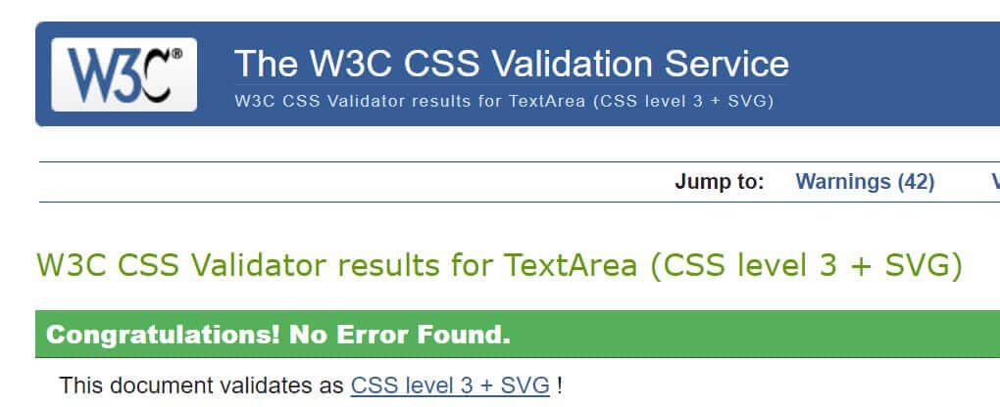
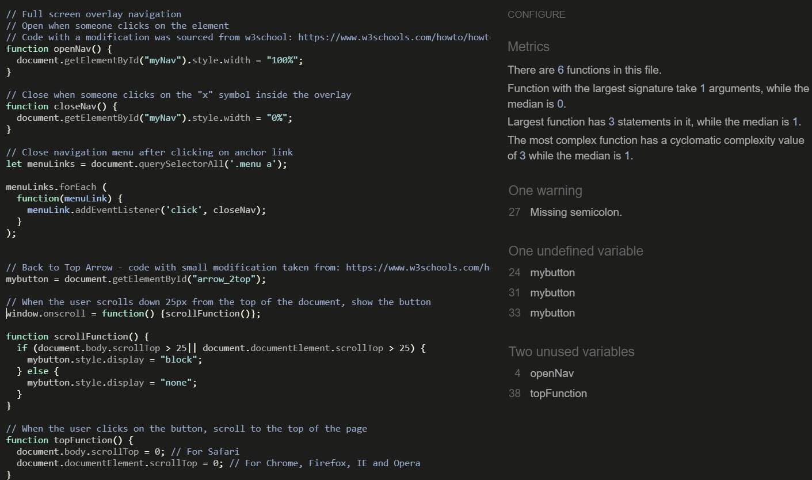

# Testing
## Table of Contents
<details>
  <summary>Click to expand table of contents</summary>

1. [User Stories Testing](#user-stories)
2. [Code Validation](#code-validation)
3. [Functionality Testing](#functionality-testing)
4. [Encountered Issues](#encountered-issues)
5. [Performance Testing](#performance-testing)
</details>

# User Stories Testing
## Visitor Stories
**As a site visitior, I would like to gain an understanding of the website's purpose from the landing page.**
- A hero image, placed towards the top of a webpage gives immediately a first glimpse on the website's content and purspose.
- Strategically placed headline also indicates to the user what is the websites purpose.

<h2 align="center"></h2>

**As a site visitor, I would like to easily navigate through the site and find what I'm looking for with an ease.**

- A navigation menu is placed in the top left corner of the website. Originally I planned to just have a hamburger icon (without menu wording) but in this way it will be more obvious to the users that this is a navigation menu.
<h2 align="center"></h2>

- When the user clicks on the hamburger icon, a full screen overlay navigation appears which allows the user to easily access any section on the website.
<h2 align="center"></h2>

- Back to top arrow button appears on the lower right of page when the user start to scroll down the page. Once clicked, it jumps to the top of the webpage which reduces the time to manually scorll up the website.
<h2 align="center"></h2>

**As a site visitor, I would like to find the aesthetics of the website enjoyable.**
- The home section with hero image is eye-catching and graphically attractive which should keep the visitor's attention.
<h2 align="center"></h2>

- Clean design was used throughout the website. The attention was paid to the colors, eye-catching images and textual content.
The website was designed to be elegant but simple and easy to use. The elements of the website are visually connected and balanced. 
<h2 align="center"></h2>

- A full screen overlay navigation is modern and distinctive and the visitors can easyily find what they are looking for.

**As a site visitor,I want to use interactive elements on the website.**


**As a site visitor, I would like to be able to easily find and navigate to the company's social media.**
- Social media icons are placed in header section, located in the top rigth corner of the website. The media icons were strategically placed at this position. By clicking either on Facebook, Instagram or Twitter icon, mentioned social media pages will open in a new window.

<h2 align="center"></h2>

**As a site visitor, I want to get in touch if I might have any queries.**

- The contact form is located under the website's Contact section. The contact form is connected using EmailJS service which allows users to send an email directly without using the server.
SweetAlert2 was used to add an interactive custom modal popup window when a user submits a contact form. Success or error message will display depending on if the user correctly or incorrectly uses the forms on the website.

<h2 align="center"></h2>

<h2 align="center"></h2>

- The email notification sent to the website owner:

<h2 align="center"></h2>

**As a site visitor, I want to use map to find exciting national parks in Japan and based on the provided information make a decision what places to visit.**

- Google Maps API was used to dispay the ten most beautiful national parks of Japan. When hover over the marker, the national park's name shows.
And when the user clicks on the marker, the national park information with the correspoing image changes on the left side based on the marker the user clicked.

<h2 align="center"></h2>
<h2 align="center"></h2>

**As a site visitor, I want to get information how to get to the national parks.**

- Under each national park there is a paragraph "How to get there" which gives the user the information on how to get to this particual national park. This paragraph is placed as the last paragraph undre the all national parks information section.

<h2 align="center"></h2>

**As a site visitor, I want to find about the current weather and accordingly plan my visit.**

- Under the website's Weather location, the user can select a national park from the drop-down menu. Upon selection, the weather data will get displayed with the current and todays weather data.

<h2 align="center"></h2>

<h2 align="center"></h2>

# Code Validation

- The website was validated by the [W3C Markup Validation Service](https://validator.w3.org/) to ensure there were no syntax errors or issues. 
- [W3C CSS Validation Service](https://jigsaw.w3.org/css-validator/) was used to validate CSS code.
- [JSHint](https://jshint.com/) was used for JavaScript code validation was used for validation of JavaScript.

## [W3C Markup Validation Service](https://validator.w3.org/) - Markup Validation

- There are no errors or warnings. 

    <h2 align="center"></h2>

## [W3C CSS Validation Service](https://jigsaw.w3.org/css-validator/) - CSS Validation

- There are no errors.
- There are several warnings about the vendor prefixes which can be ignored.

    <h2 align="center"></h2>

## [JSHint](https://jshint.com/) - JavaScript Validation
# script.js

- There are no errors
- There is one warning showing for a missing semicolon which doesn't make sense sice the semicolon is added (line 27)

<h2 align="center"></h2>

# maps.js

- There are no errors or warnings

<h2 align="center"></h2>

# sendEmail.js
- There are no errors or warnings

<h2 align="center"></h2>

# weather.js

- There are no errors or warnings

<h2 align="center"></h2>

# Functionality Testing 

Comprehensive testing was executed. Further elaborated in more details below:
## Navigation menu

- A full screen overlay navigation is fully functional and responsive.
- When clicked on the nav links every navigation link goes to the expected section and the overlay navigation closes.
- When hover over each navigation link, it changes the color correctly.
- Close button (x) works correctly - it closes the overlay navigation

## Social media icons
- Social media icons once clicked open the expected link in a new tab.

## Hero image

- 

## Map functionality

- Tooltip 


## Weather functionality

- Tooltip

## Button

- The button under Contact (Get in touch!) section works as expected. When clicked it sends the email.
- When hover over, the button changes to expected background and border color.
- Back to top arrow button appears on the lower right of page when the user start to scroll down a page. Once clicked, as expected it jumps to the top or the webpage.

## Contact form

- All properties in the contact form are required. 
- The contact form was tested for the validation by submitting first without inputs and then by filling the properties one by one. All worked as expected, all properties asked for the input. Furthermore, the email property asks for the email format with @ symbol.
- The contact form is connected using EmailJS service which allows users to send an email directly without using the server. This functionality works as expected.
- SweetAlert2 was used to add an interactive custom modal popup window when a user submits a contact form. Success or error message displays depending on if the user correctly or incorrectly uses the forms on the website.

## Browser Testing

- The website was tested on the bellow browser. All browser versions were up to date.
  - Google Chrome
  - Firefox
  - Microsoft Edge
  - Safari
  - Chrome for Android
  - Samsung Internet

I didn't encounter any issue, the website is fully functioning and fully responsive on all above mentioned browsers. Further testing was done using [BrowserLing](https://www.browserling.com/) for Internet Explorer 11.
## Device Testing

- The website was physically tested on the following devices with different screen sizes:
  - iPhone 7 (Safari & Google Chrome)
  - iPhone 8 (Safari & Google Chrome)
  - Samsung GTI9505 Galaxy S4 (Chrome for Android)
  - Samsung Galaxy 9 (Chrome for Android & Samsung Internet)
  - Samsung Galaxy S20 (Chrome for Android & Samsung Internet)
  - Nokia 6.1 (Microsoft Edge)
  - Nokia Lumia 640 LTE (Windows 10) (Microsoft Edge)
  - UAWEI P30 lite (Chrome for Android)
  - Samsung Galaxy Tab A (Chrome for Android & Samsung Internet)
  - Lenovo ThinkBook 13S

The results were consistent, the website is platform-cross compatible and responsive.
Furthermore, using DevTools I checked responsiveness for different screen sizes for mobile and tablet devices. Couple of issues were found and fixed all described under [Encountered Issues](#encountered-issues) section.

# Encountered Issues
Several bugs were encountered during the coding process:

- A full screen overlay navigation didn't work on mobile devices.

**Fixed** by adding `z-index: -1;` to social-header element.


- Issue with displaying weather data for multiple locations.


```
let e = document.getElementById('nationalParks');
    let locationWeather = e.value;

  function findLocation() {
    for (i = 0; i < locationID.length; i++) {
      console.log("location: ", locationID[i])
      if (locationID[i].name === locationWeather) {
        console.log("location: ", locationID[i])
        return locationID[i].cityID;
      }
    }
  }
```

- Google Maps API infoWindow


- For devices with smaller screen size (i.e. iPhone5) the header section elements were too close together which was causing a bad UX.
<h2 align="center"></h2>

**Fixed** by adding the media query for screen size min-width of 320px and by adding the following css code:
    
    ```
    @media only screen 
      and (min-device-width: 320px) 
      and (max-width: 568px)
      and (-webkit-device-pixel-ratio: 2) 
      and (min-aspect-ratio: 40/71) and (orientation:portrait) {

      .logo {
        width: 65px;
        height: 65px;
      }

      #hamburger {
        font-size: 1.5 rem;
        margin-left: 0.5rem
      }

      .social-media i {
        margin-right: 0.4rem !important;
      }
    }
    ```

Media queries for the iPhone5 were found on the following article: Coderwall.

- The bounce arrow positioned on the bottom of the hero background image wasn't showing on device iPad Pro 12.9"
<h2 align="center"></h2>

**Fixed** by adding the following css code:

 ```
@media only screen 
  and (min-device-width: 1024px) 
  and (max-device-width: 1366px)
  and (-webkit-min-device-pixel-ratio: 2) {

    .arrow {
       bottom: 6rem;
    }
}
```

# Performance Testing
Performance was tested using [Lighthouse](https://developers.google.com/web/tools/lighthouse) tool.

## Desktop

<h2 align="center"></h2>

The results were somewhat different every time. Following article [Why are my Lighthouse scores different from my other test results?](https://support.speedcurve.com/en/articles/4088236-why-are-my-lighthouse-scores-different-from-my-other-test-results#:~:text=The%20performance%20score%20is%20strongly,cause%20variability%20in%20your%20scores.) gives an explanation on Lighthouse that "the performance score is strongly influenced by Time to Interactive (TTI) and Total Blocking Time (TBT), which can be quite different depending on the test environment and runtime settings." 

The performance results are satisfying as the the website is heavy loaded with the content.

## Mobile
Lighthouse testing results were somewhat different every time.
<h2 align="center"></h2>

## Accessibility
The website accessibility was tested using DevTools and checking contrast ratio. 
The results are satisfying.
The performance results are satisfying as the the website is heavy loaded with the content.

<br>
Click here to return to [README.md](README.md) file.